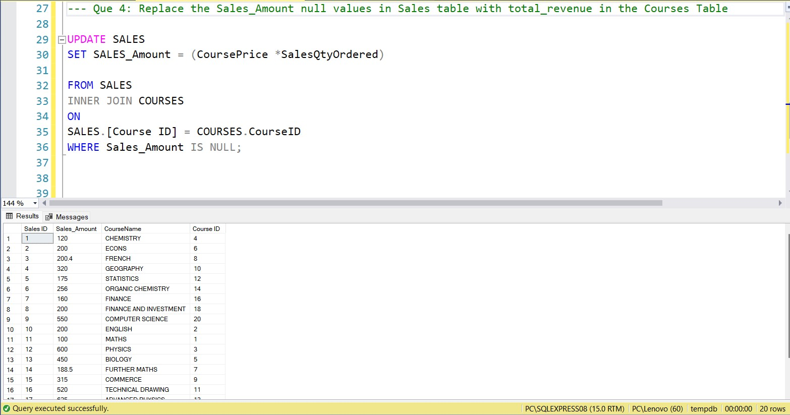

# SQL-Interview-Intermediate-Level

## Introduction
This project is based on real life interview for the role of BI Analyst for a top organization. It is an intermediate level SQL where I was given 30mins to answer the questions. I decided to solve it and share to upcoming Data Analyst so they can have an idea things to expect in the real life. There are 3 tables involved: Customer, Courses and Sales table.

**_Disclaimer_** : _The data used was formulated and does not represent any company, institution or country. This is just sharing my real life experience and knowledge to the tech space._

## Problem Statement 

The aim of this analysis is to answer the following Interview related questions

- Update Customer Cell Number Column in the Customer table to have +31- before the main Cell No's?
- Change the CourseName column in the Courses table to all Uppercase?
- Replace the CourseName null values in Sales table with the CourseName in the Courses table?
- Replace the Sales_Amount null values in Sales table with total_revenue in the Courses table?

## Skills Used
- Critical Thinking
- Composure
- use of logic
- Functions
- Filters
- Joins
- SQL skills

## Question 1: Update Customer Cell Number Column in the Customer table to have +31- before the main Cell No's?
Below is what the original customer table looks like

Below is the query used to answer the question

## Question 2: Change the CourseName column in the Courses table to all Uppercase?
The initial table looks like this

Below is the query used to answer the question

## Question 3: Replace the CourseName null values in Sales table with the CourseName in the Courses table?

The initial Sales table looked like this

The query below was used to answer the question

## Question 4: Replace the Sales_Amount null values in Sales table with total_revenue in the Courses table?

Below is the query used to solve this question

## Conclusion:

This interview tested my ability on how to make modifications to different tables in the database. I hope you have been able to gain 1 or 2 things. Please if you find this useful, kindly share with others. The sql file is attached to my files. 
### [FOLLOW @ahmed adamu](https://www.linkedin.com/in/ahmed-adamu-0b63b9a5)
